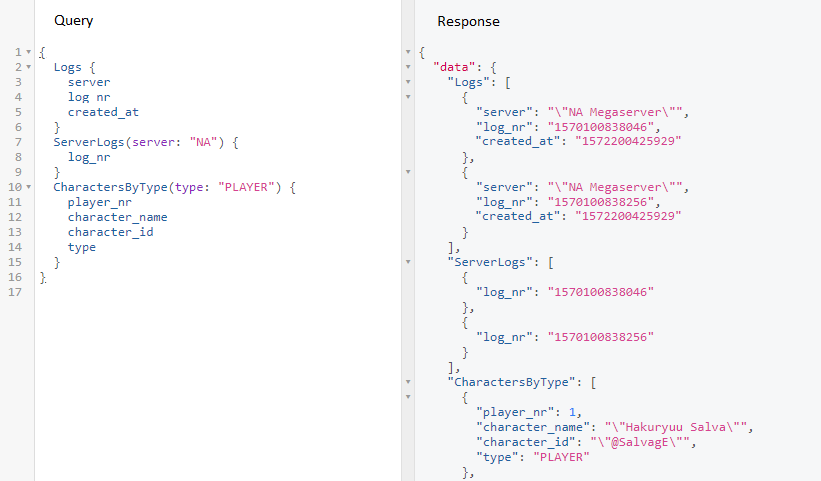
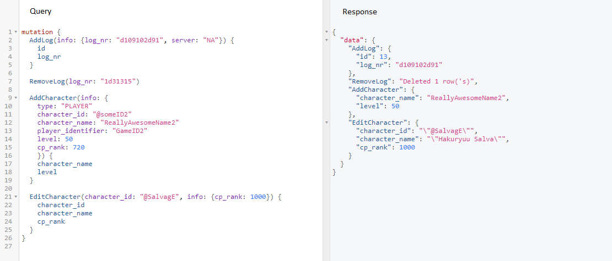

# ESO Logs parser

## Disclaimer

This was created during my time as a student at Code Chrysalis

## Desciption


This API is primarily used to look through the logs of a popular MMORPG called Elder Scrolls Online.

While very much a work in progress, the idea is to be able to lookup direct info, from the log files.<br>
Due to the vast amount of data loading and parsing could take some time, so please be patient.

At this moment the api can handle only 1 log file at a time (for 1 event). As such, all the data is considered _*related to 1 event log*_.

> Used tech:

- DBMS used is Postgres.
- Queries are handled by GraphQL.
- Server: express-js.

During testing, direct access to most of the data is allowed, meaning it is possible to add/remove/edit data directly using queries.<br>
In the future, it is planned that data etry will be allowed only via actual ESO log uploads.

## Installing Dependencies and Startup

1. Make sure you have a Postgres database available.

- default DB name is set to "esologs"<br>
  Change the name if you already have a DB you want to use, or run the below script to create a DB with the `esologs` name.<br>
  _//Warning_: Need to have postgress install and `psql` alias configured. Otherwise instead of `psql` write the full postgress launch command.

```bash
  echo "CREATE DATABASE esologs;" | psql
```

- default DB username is set to "postgres".<br>
  If your DB setup differs, please update the `database`, `user`, `password` fields in the `config.js` file of the root folder.

2. Install dependencies by running:

```bash
    yarn
```

3. Run migrations and set up the database by running:

```bash
    yarn migrate
```

- If there were some problems and you need to reset the DB (roll back migrations), use

```bash
    yarn rollback
```

4. To Seed the DB with some initial data , make sure that there is a log file inside the `src_file` folder.
   Please note the size of the file is limited to no more than 15 MB at this point (this might vary depending on the actual amount of data added).
   To seed the db, run:

```bash
    yarn seed
```

With the above steps complete, the setup is done.<br>
_*NOTE:*_ Can also use `npm run` instead of `yarn`.

## Basic USE

- To start the app run:

```bash
    yarn start
```

- Navigate to `localhost:3000` in your browser to see the overview.
- Navigate to `localhost:3000/graphql` in your browser to test out the queries.

Below you fill find the exposed enpoints that can be used to query and mutate data. The details for available fields can be checked in the structure section.

_Query endpoints:_

- `Logs` - takes no parameters, returns an array of `log` types.
- `ServerLogs` - takes an `server` parameter with a server Name value (partial matching works). Returns an array of `log` elements that match the given parameter.
- `Characters` - takes no parameters. returns an array of all `Character` types from the `player` table.
- `CharactersByType` - takes a `type` parameter with a string value of character type(see structure). returns an array of `Character` types that match criteria.
- `Character` - takes a `character_name` or `character_id` parameter, with a string that matches the name or id. returns the first `Character` type that matches the parameter.
  > Example:



In case of editing, a `info` parameter is expected, holding the key:values to edit.
Adding a `key` will be considered as desire to overwrite the current value, even if value is not given (will be set to null);
_Mutation endpoints:_

- `AddLog` - takes an `info` parameter with the required fields (see Structure below). Returns the added `log` element.
- `EditLog` - takes a non-null `log_nr` identifier and `info` parameter. Will edit the `log` matching the provided `log_nr` with the values in the info object.
  Once complete, will return the `element after edit.
- `RemoveLog` - takes a `log_nr` non-null string as a parameter. Removes it from the DB and returns the `log` element that was removed or null if not found.
- `AddCharacter` - takes an `info` parameter with the required fields (see Structure below). Returns the added `Character` element.
- `EditCharacter` - takes a `character_name` or `character_id` non-null string, and an `info` object as a parameter. Edits the `Character` element that matched the name or id and returns the edited version.
- `RemoveCharacter` - takes a `character_name` or `character_id` non-null string as a parameter. Removes it from the DB. Returns the removed element info or null.

> Example:



## Basic Structure of added elements:

Below you will find a description of the currently added tables and relationships.
Obligatory fields for input are marked with a `(*)`.

- _logs:_
  The logs have 4 fields:

  - id - autogenerated on addition
  - log*nr (\*) - a unique log number generated to keep track inside the log file.
    */TO DO\_: add a link to .the players table to support handling multiple logs
  - server (\*) - the name of the server where the log was created.
    _/INFO_: The initial seed data has only "NA Megaserver", "EU Megaserver", "PS4 NA Megaserver"
  - date_added - autogenerated on addition

- _players:_
  Although named `player`, this table includes data on everything the game considers a 'Character Unit"
  - id - autogenerated on addition
  - type (\*) - the type of unit
    _/INFO_: for players - "PLAYER", for other units - "MONSTER"
  - player_nr - a game generated nr to keep track of units within the log
  - character*name (\*) - the unit name
    */INFO\_: for players - character name, for monsters - monster name
  - character*id (\*) - the game issued @id
    */INFO\_: for players - their login ID, for monsters - ""
  - player_identifier (\*) - game issued unique hash id.
  - level (\*) - the unit level (Integer)
    _/INFO_: an integer between 0 and 50
  - cp*rank (\*) - Champion Point rank
    */INFO\_: an integer value largen than 0;
  - added - boolean to check whether the unit was Added (T) or removed (F) from the log tracking
  - action_at - a stringified timestamp. Amount of miliseconds from the start of the Encounter log.

## NEXT PLANS:

- create a relationship between a posted log and players being added removed/
- add a SKILLS table
- link skills to players
- add a visual query to the main page (even listener from form that has a fetch??)
- allow uploads from files;

## Additional

For any suggestions, ideas, or fixes, don't hesitate to open an issue or contact me at `igor.m.byak@gmail.com`
